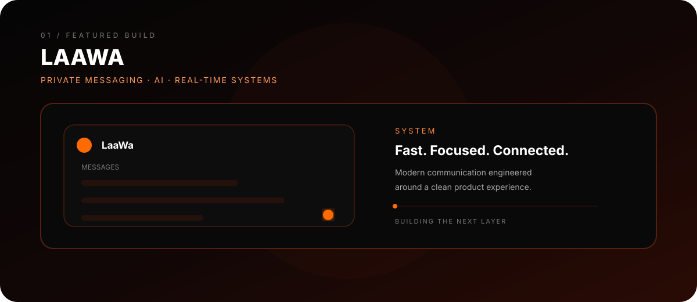

<div align="center">


<br>

[](https://github.com/laavastudios)
[](https://github.com/laavastudios)
[](https://github.com/laavastudios)

</div>

---

## `01 // IDENTITY`

<div align="center">

**AI ENGINEER · SOFTWARE BUILDER · SYSTEMS ARCHITECT**

Building AI-first products, developer tools and real-world systems — from architecture and interfaces to automation and deployment.

`AI` `LLMs` `AGENTS` `AUTOMATION` `WEB` `MOBILE` `SYSTEMS`

</div>

```ts
const laava = {
  role: "AI Engineer & Software Builder",
  base: "India",
  focus: ["AI systems", "LLM applications", "agents", "automation", "products"],
  rule: "Understand → Build → Ship → Improve",
};
```

---

## `02 // THE LAAVA SYSTEM`

<div align="center">

</div>

---

## `03 // CURRENT FOCUS`

<div align="center">

</div>

---

## `04 // FEATURED BUILD / 01`

<div align="center">


### [LaaWa](https://github.com/laavastudios/LaaWa)

**AI business command center built around WhatsApp conversations, lead capture, appointments, automations and AI-assisted operations.**

`NEXT.JS` · `TYPESCRIPT` · `POSTGRESQL` · `GEMINI` · `WHATSAPP` · `AUTOMATION`

</div>

---

## `05 // BUILT / 02`

<div align="center">

### [Laava Client](https://github.com/laavastudios/Laava-Client-Releases)

Android client engineering for the Laava ecosystem.

`KOTLIN` · `ANDROID` · `UI/UX` · `NETWORKING`

</div>

---

## `06 // ENGINEERING STACK`

<div align="center">


<br><br>

`LLM ENGINEERING` · `AI AGENTS` · `MCP` · `AUTOMATION` · `APIs` · `INFRASTRUCTURE`

</div>

---

## `07 // THE BUILD LOOP`

<div align="center">

</div>

---

## `08 // HOW I BUILD`

<div align="center">

`01` **Understand the problem**  →  `02` **Design the system**  →  `03` **Build the product**  →  `04` **Break it**  →  `05` **Ship it**  →  `06` **Improve it**

</div>

---

## `09 // TERMINAL`

<div align="center">

</div>

---

<div align="center">


<br><br>

**Made in India · Built by Laava Studios**

`AI × SOFTWARE × SYSTEMS`

</div>
