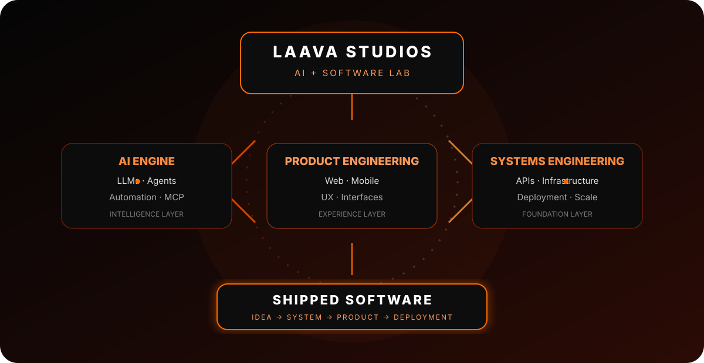
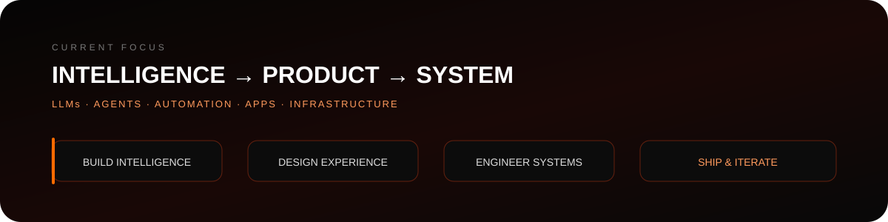
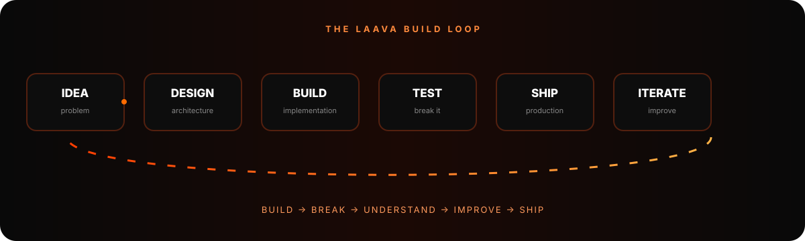
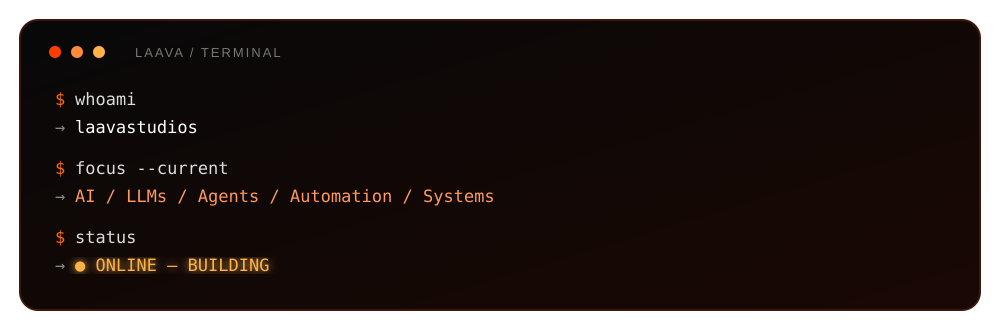

<div align="center">


<br>

[](https://github.com/laavastudios)
[](https://github.com/laavastudios)
[](https://github.com/laavastudios)
[](https://github.com/laavastudios)

</div>

---

## `01 // IDENTITY`

<div align="center">

### LAAVA STUDIOS

**AI Engineer · Software Builder · Systems Architect**

> Building intelligent software, developer tools, clients and automation systems with an obsession for clean architecture and execution.

<br>

`AI` `LLMs` `AGENTS` `AUTOMATION` `WEB` `MOBILE` `OPEN SOURCE` `SYSTEMS`

</div>

```ts
const laava = {
  name: "Laava Studios",
  role: "AI Engineer & Software Builder",
  base: "India",
  focus: [
    "AI systems",
    "LLM applications",
    "AI agents",
    "developer tooling",
    "automation",
    "web & mobile products",
  ],
  mindset: "Understand the system. Build the system. Ship the system.",
};
```

---

## `02 // THE LAAVA SYSTEM`

<div align="center">



<br>

**Three layers. One objective: turn intelligence into software that ships.**

</div>

---

## `03 // CURRENT FOCUS`

<div align="center">



</div>

---

## `04 // BUILT IN PUBLIC`

<div align="center">

<table>
<tr>
<td width="50%" valign="top">

### Laava Client

A focused Android client inside the Laava ecosystem.

`Android` · `Kotlin` · `UI/UX` · `Networking`

[→ Repository](https://github.com/laavastudios/Laava-Client-Releases)

</td>
<td width="50%" valign="top">

### Amethyst Offline

Offline-oriented launcher work with automated mobile build workflows.

`Android` · `iOS` · `Build Systems` · `GitHub Actions`

[→ Repository](https://github.com/laavastudios/Amethyst-Offline)

</td>
</tr>
</table>

</div>

---

## `05 // ENGINEERING STACK`

<div align="center">

### Languages


### Intelligent Systems


### Application


### Infrastructure


</div>

---

## `06 // THE BUILD LOOP`

<div align="center">



</div>

---

## `07 // ENGINEERING PHILOSOPHY`

<div align="center">

| PRINCIPLE | APPROACH |
|:---:|---|
| **01** | Build the real thing, not just the demo. |
| **02** | Prefer systems that are understandable and maintainable. |
| **03** | Automate repetitive work aggressively. |
| **04** | Treat UX as part of engineering. |
| **05** | Keep ownership of the stack whenever practical. |
| **06** | Ship, observe, improve, repeat. |

</div>

---

## `08 // LIVE GITHUB SIGNAL`

<div align="center">


<br><br>


</div>

---

## `09 // TERMINAL`

<div align="center">



</div>

---

## `10 // LAAVA`

<div align="center">


<br><br>

**Made in India · Built by Laava Studios**

`AI × SOFTWARE × SYSTEMS`

</div>

<div align="center">


</div>
